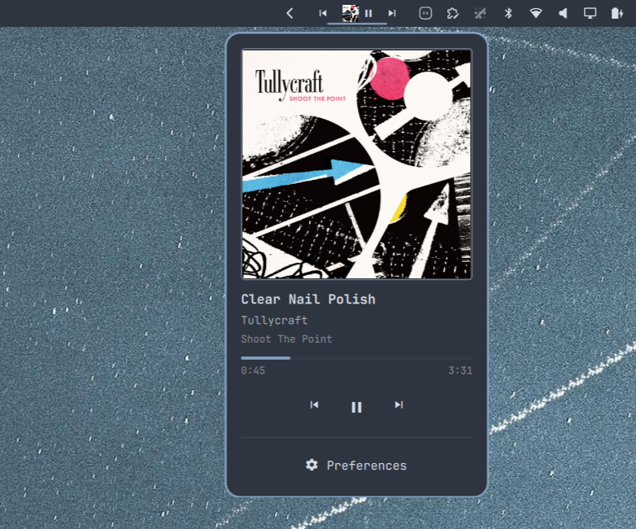

# Omaqobuz

<p align="center">
  
</p>

Now playing from the [Qobuz](https://www.qobuz.com/) desktop app (QBZ), in the
Omarchy bar: album art, track and artist, a progress bar, and playback controls.

The widget binds to QBZ specifically rather than following whichever player is
active, so a browser tab or a video call never takes over the bar. When QBZ is
closed the widget disappears.

## Requirements

- Omarchy with the Quickshell-based `omarchy-shell`
- The Qobuz desktop app (`qbz`), which publishes
  `org.mpris.MediaPlayer2.com.blitzfc.qbz`

## Install

```bash
omarchy plugin add https://github.com/missioncontrolceo/omaqobuz.git
omarchy plugin enable missioncontrolceo.omaqobuz --section right
```

Review the code first — Omarchy plugins run unsandboxed inside `omarchy-shell`.

## Remove

```bash
omarchy plugin remove missioncontrolceo.omaqobuz
```

That drops the widget from the bar layout and deletes the plugin directory
(keeping a timestamped backup alongside it). Nothing else on the system is
touched, so removal leaves no configuration behind.

## Using it

In the bar the widget shows the cover thumbnail, a play/pause glyph, and the
current track. Optional previous/next buttons can sit either side of it.

| Action | Result |
|--------|--------|
| Left click | Now-playing card: large cover, track/artist/album, progress, transport controls |
| Right click | Preferences |
| Middle click | Next track |
| Scroll up / down | Previous / next track |

## Preferences

Right-click the widget (or use the Preferences button on the now-playing card).
Every toggle is written back to the widget's entry in
`~/.config/omarchy/shell.json`, so it survives a restart.

| Setting | Default | What it does |
|---------|---------|--------------|
| `scrollLabel` | `true` | Marquee the track info; off keeps it still and trims it to fit |
| `showSkipButtons` | `false` | Previous/next buttons either side of the track |
| `showArt` | `true` | Cover thumbnail in the bar |
| `showLabel` | `true` | Track info in the bar |
| `maxLabelWidth` | `180` | Width the track info is capped to, in px |

`maxLabelWidth` has no toggle; set it inline on the bar entry:

```json
{ "id": "missioncontrolceo.omaqobuz", "maxLabelWidth": 260 }
```

## What it touches

The only file it writes is `~/.config/omarchy/shell.json`, and only its own bar
entry, only when you flip one of its preference toggles. It never edits another
widget's settings, and it runs no external commands.

It reads MPRIS through `Quickshell.Services.Mpris` — no polling of the Qobuz
app, and no network access of its own beyond loading the cover image URL that
QBZ publishes.

## License

MIT — see [LICENSE](LICENSE).
